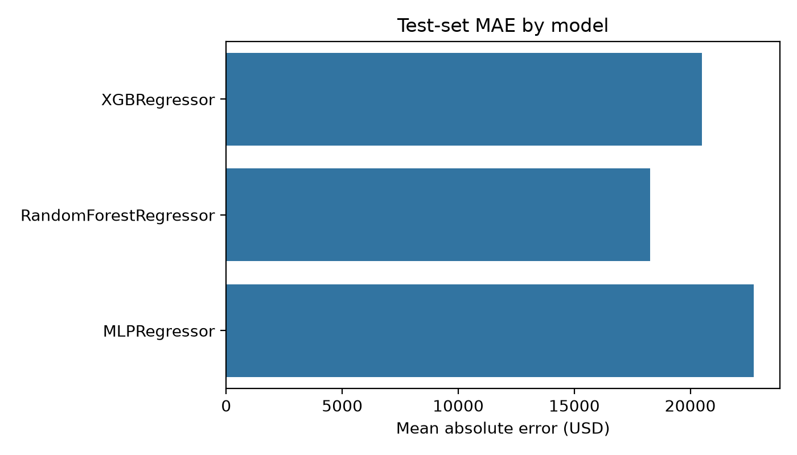

# House Prices: model comparison and interpretability

## Method

The pipeline uses the numeric columns in the Kaggle House Prices training set, holds out 30% of the data with a fixed random seed, and compares XGBoost, RandomForest, and a seeded MLP. The mean absolute error is the primary metric; RMSE and R² are retained as secondary diagnostics.

## Results

| Model | MAE (USD) | RMSE (USD) | R² |
| --- | ---: | ---: | ---: |
| XGBRegressor | 20495.53 | 40170.84 | 0.7781 |
| RandomForestRegressor | 18263.05 | 31265.58 | 0.8656 |
| MLPRegressor | 22725.55 | 43820.97 | 0.7359 |

## Interpretation

RandomForestRegressor gives the lowest test MAE in this fixed-seed run. The raw test predictions and processed metrics are generated by the pipeline, and each model has an accompanying SHAP bar and beeswarm figure when SHAP is enabled. Because only numeric columns are used, these values are not directly comparable with public leaderboards that include engineered categorical features.
