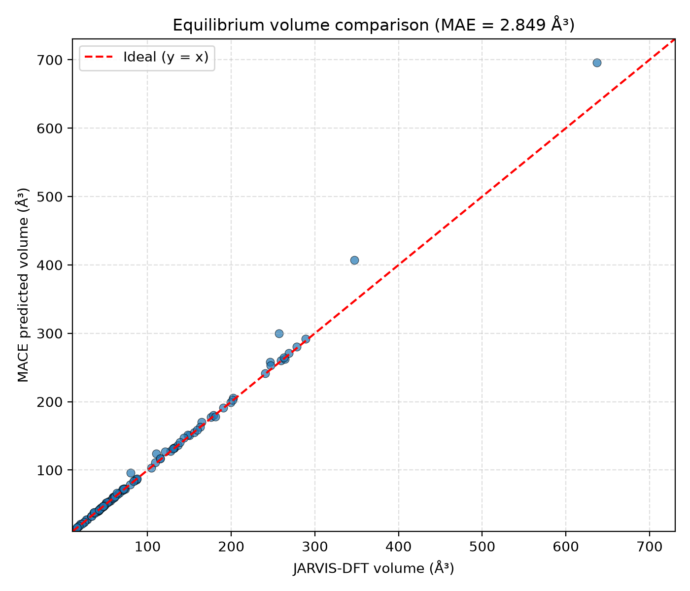

# MACE/JARVIS equilibrium-volume benchmark

## Method

MACE-predicted equilibrium volumes are normalized to JARVIS material IDs and joined one-to-one with JARVIS-DFT `dft_3d` reference volumes. The evaluation reports MAE, RMSE, and MAPE and draws a parity plot against the ideal one-to-one line.

## Results

- Matched materials: 104
- MAE: 2.8487 ų
- RMSE: 9.7171 ų
- MAPE: 1.83%

## Interpretation

The low MAPE indicates close overall agreement across the matched benchmark set, while the RMSE is substantially larger than the MAE, suggesting a small number of large deviations. The per-material errors are retained in the raw comparison table for targeted follow-up.
